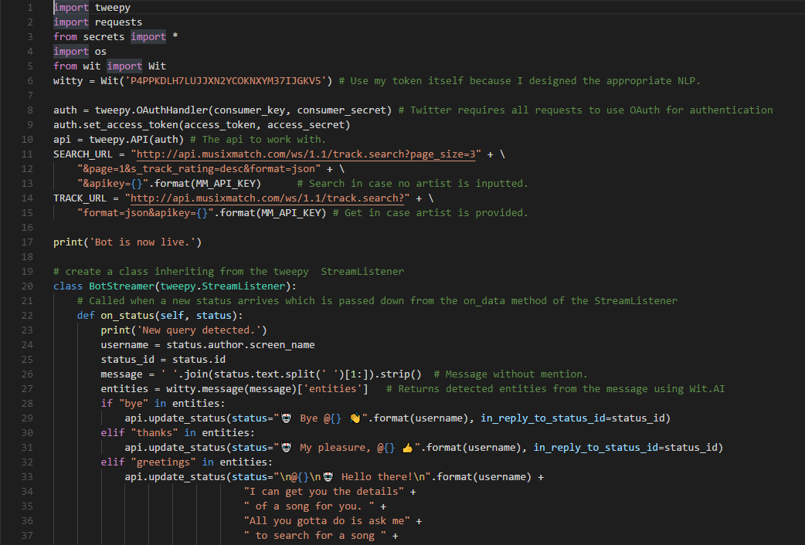
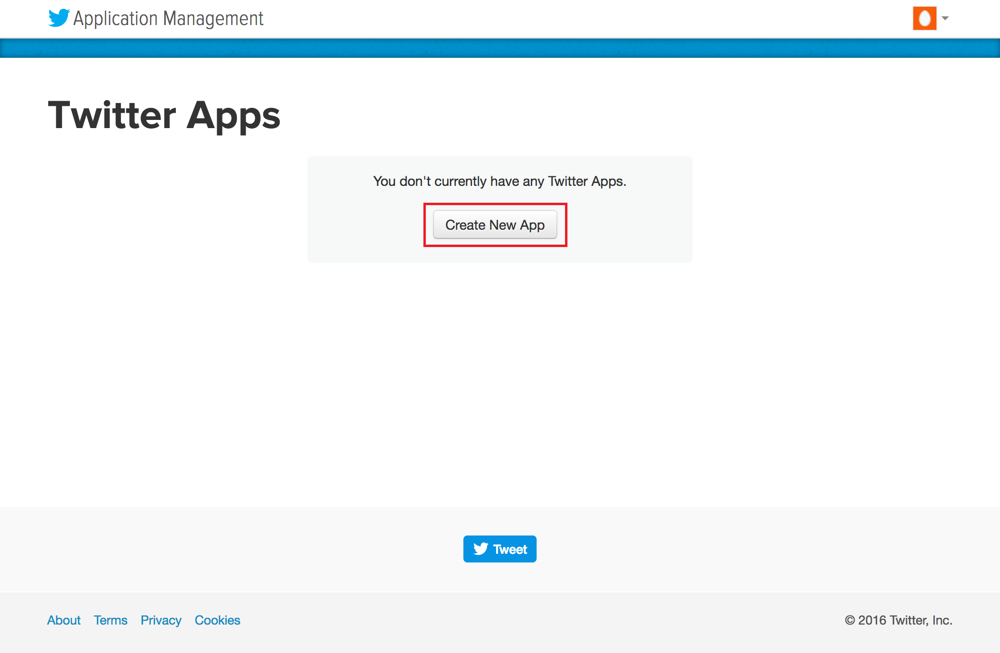
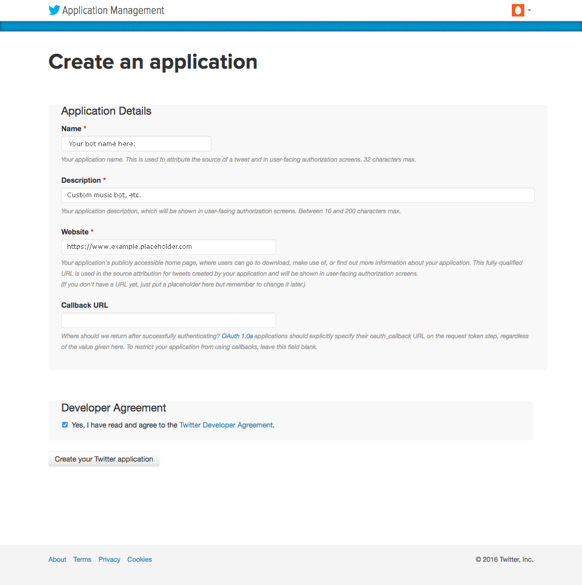
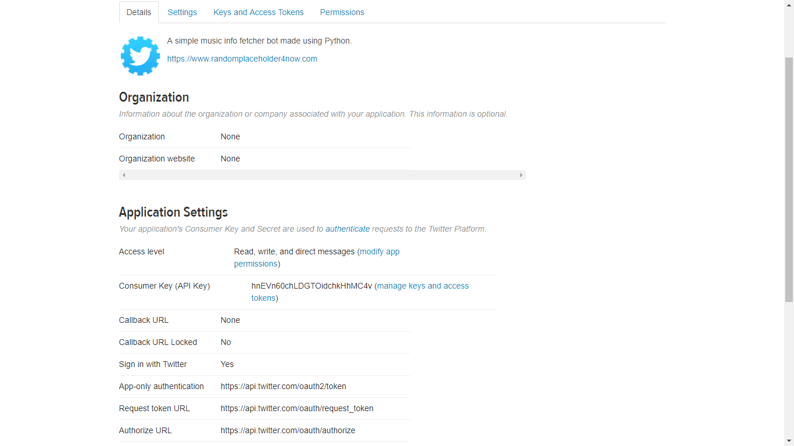
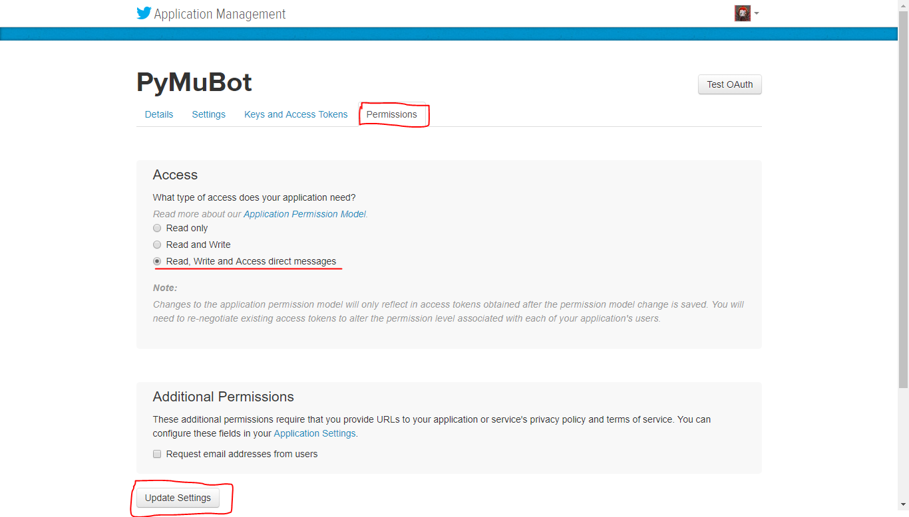
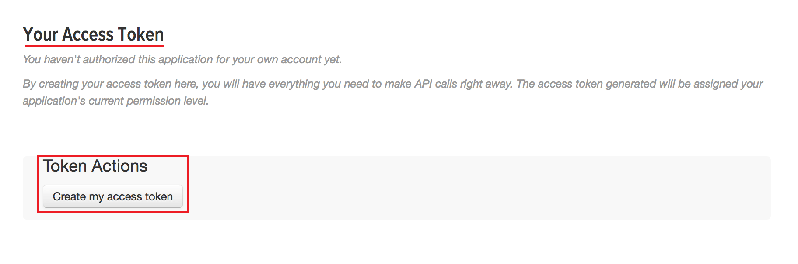
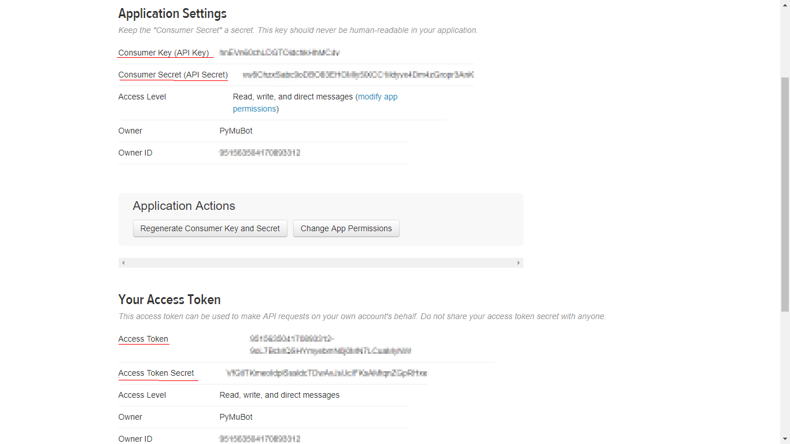
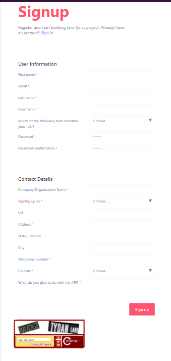
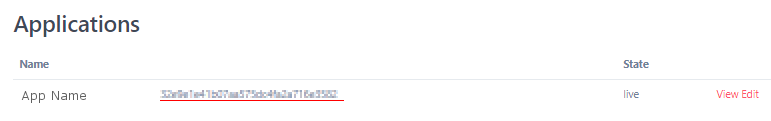

# Python Music Twitter Bot

**PyMuBot** is a simple twitter messenger bot whom you can ask about the details for a song using simple human language. All you have to do is, mention `@PyMuBot` in your status and it will respond to you soon. It is made by [Harshith Thota](https://github.com/Hyperclaw79) using [Python 3.5](https://www.python.org/downloads/release/python-364/). It is live thanks to hosting by [Hasura](https://hasura.io).

## See it in action:


## Code Sneak-Peak:


## Overview
* __<u>Connections</u>__:
Since Python is the platform, we have a wonderful library called [Tweepy](https://github.com/tweepy/tweepy). It handles the OAuth handshake with the Twitter server and provides easy to use API. This bot exploits those features along with other APIs to get the music information for a query.
[Requests](https://github.com/requests/requests) module is also used as it is battle-tested and the most efficient way to deal with REST commands in Python.
* __<u>Music Information</u>__:
[MusixMatch API](https://developer.musixmatch.com/documentation) is used for fetching the song information like artist name, album name, lyrics link, etc. Since there is a bug with the cover albumart, we resort to another free API from [Last.FM](https://www.last.fm/api/intro) to get the album covers.
* __<u>Natural Language Processing</u>__: PyMuBot can understand and extract the song name and artist name from a phrase like, `"Get me the details for Some_Song by song_artist"`. This is done through nlp offered by Wit.AI. We use `wit` module for Python to interact with it. Since a good nlp requires training, it is better to use an already trained model, like the [one](https://wit.ai/Hyperclaw79/WittyMusicBot) created by **Harshith Thota** instead of training one from scratch.

## Pre-requisites

* [Python 3.5](https://www.python.org/downloads/release/python-364/)

* [hasura CLI](https://docs.hasura.io/0.15/manual/install-hasura-cli.html)

## Getting the bot running

### Create a twitter application:
---
>Prior to creating a Twitterbot, you should become familiar with Twitter’s [Automation rules and best practices](https://support.twitter.com/articles/76915#) to ensure that your Twitterbot is a good member of the Twitter community.

* First create a Twitter account and have the mobile number verified. 
>Hint: Try to make the account look like a bot's account by using appropriate username, profile pic, etc.
* Visit https://apps.twitter.com/ then log in using your Twitter account credentials. Once logged in, click the button labeled `Create New App`.



* You will now be redirected to the application creation page. On this page, you’ll fill out the required fields. 
* Read the Twitter Developer Agreement. If you agree to continue at this point, click the checkbox next to the line that reads, **Yes, I have read and agree to the Twitter Developer Agreement**.
>Note: The name that you provide for your app must be unique to your particular app. You cannot use the name as shown here since it already exists. 




* Once you click the Create your Twitter application button at the bottom of the page, you’ll receive a confirmation page. After successfully creating your application, you will be redirected to your application's Details page, which provides you with some general information about your app.



* Navigate over to the Permissions tab. Select the `Read, Write and Access direct messages`. This will allow your application to post on your behalf. Click on `Update Settings` to save these settings.



* Switch to `Keys and Access Tokens` tab. This will take you to a page that lists your Consumer Key and Consumer Secret, and also will allow you to generate your Access Token and Access Token Secret. These are necessary to authenticate our client application with Twitter. Click the button labeled `Create my access token` under the `Access Token` heading to generate your `Access Token` and `Access Token Secret`.



* Store the following keys and values in some place:
  - Consumer Key
  - Consumer Secret
  - Access Token
  - Access Secret

  

### Getting the MusixMatch API Token:
---
* Got to the [MusixMatch Developer Signup](https://developer.musixmatch.com/signup) page. Fill in all the details and finish registering. Verify your email address and it login with your new account.



* Now go to your [Applications](https://developer.musixmatch.com/admin/applications) tab in your `Dashboard`. Store the token shown in the image in the same place where you stored the previous tokens.



### Getting the Hasura project:
---
```sh
$ hasura quickstart hyper/PyMuBot
$ cd PyMuBot
# Add all the secrets you stored earlier.
$ hasura secrets update bot.musix_match_token.key <YOUR-MXM-TOKEN>
$ hasura secrets update bot.consumer_token.key <YOUR-CONSUMER-TOKEN>
$ hasura secrets update bot.consumer_secret.key <YOUR-CONSUMER-SECRET>
$ hasura secrets update bot.access_token.key <YOUR-ACCESS-TOKEN>
$ hasura secrets update bot.access_secret.key <YOUR-ACCESS-SECRET>
# Deploy
$ git add . && git commit -m "Deployment commit"
$ git push hasura master
```

After the `git push` completes:

```sh
$ hasura microservice list
```

You will get an output like so:

```sh
INFO Getting microservices...                     
INFO Custom microservices:                        
NAME   STATUS    INTERNAL-URL(tcp,http)   EXTERNAL-URL
app    Running   bot.default              https://app.cluster_name.hasura-app.io

INFO Hasura microservices:                        
NAME            STATUS    INTERNAL-URL(tcp,http)   EXTERNAL-URL
auth            Running   auth.hasura              https://auth.cluster_name.hasura-app.io
data            Running   data.hasura              https://data.cluster_name.hasura-app.io
filestore       Running   filestore.hasura         https://filestore.cluster_name.hasura-app.io
gateway         Running   gateway.hasura           
le-agent        Running   le-agent.hasura          
notify          Running   notify.hasura            https://notify.cluster_name.hasura-app.io
platform-sync   Running   platform-sync.hasura     
postgres        Running   postgres.hasura          
session-redis   Running   session-redis.hasura     
sshd            Running   sshd.hasura              
vahana          Running   vahana.hasura
```

Verify that `app` is running.

Use this command:
```sh
$ hasura ms logs app
Bot is live.
```

Make sure it returns `Bot is Live`.

## Improvements:
Here are a few examples how you can continue building on this starter kit:
* Display more details for the song.
* Use an improve NLP to understand even more human phrases.
* Use threading and tempfile modules to optimise image saving.
* Use Hasura's filestore api as a cache to store frequently queried song album covers.
* Use a requests session object to optimize GET calls.
* Modify default bot replies.
* Generate embeds of the bot replies and use it as part of previews in the documentation.

Feel free to come up with more. If you want them to be a part of of the orginal repo, open a [Pull Request](https://github.com/Hyperclaw79/PyMuBot/pull/new/master).

## Support

If you happen to get stuck anywhere, feel free to mail me at harshith.thota7@gmail.com or contact me on Slack (`@Hyper`). Also, if you find a bug or an issue, you can raise an issue [here](https://github.com/hyperclaw79/PyMuBot).
